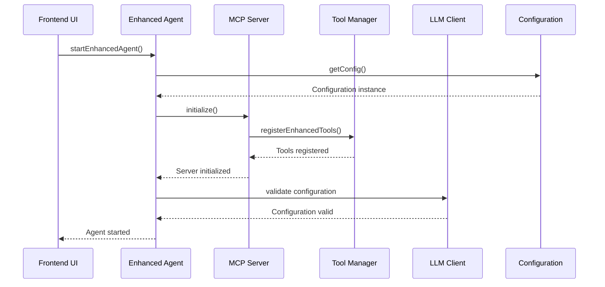
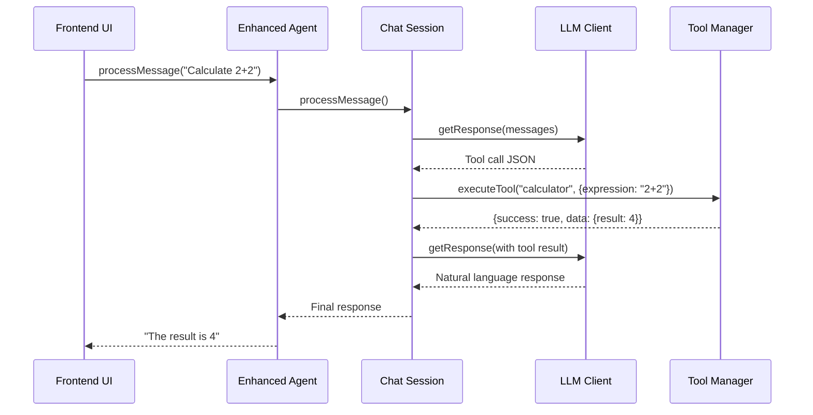

# Enhanced MCP Browser Agent Architecture

This document describes the enhanced architecture that follows the Python MCP implementation patterns, providing a more robust, maintainable, and scalable system.

## 🏗️ Architecture Overview

The enhanced architecture implements a layered approach with clear separation of concerns, following the Python implementation patterns:

```
┌─────────────────────────────────────────────────────────────┐
│                        Frontend UI                          │
│                      (App.tsx)                             │
└─────────────────────────┬───────────────────────────────────┘
                          │
┌─────────────────────────▼───────────────────────────────────┐
│                   Enhanced Agent                            │
│              (agent/EnhancedAgent.ts)                      │
│         Orchestrates all system components                  │
└─────┬─────────────┬─────────────┬─────────────┬─────────────┘
      │             │             │             │
┌─────▼─────┐ ┌─────▼─────┐ ┌─────▼─────┐ ┌─────▼─────┐
│ Chat      │ │ Enhanced  │ │ Tool      │ │ LLM       │
│ Session   │ │ MCP       │ │ Manager   │ │ Client    │
│           │ │ Server    │ │           │ │           │
└─────┬─────┘ └─────┬─────┘ └─────┬─────┘ └─────┬─────┘
      │             │             │             │
      └─────────────┼─────────────┼─────────────┘
                    │             │
              ┌─────▼─────┐ ┌─────▼─────┐
              │ Enhanced  │ │ Config    │
              │ Tools     │ │ Manager   │
              │           │ │           │
              └───────────┘ └───────────┘
```

## 📁 Directory Structure

```
frontend/src/
├── enhanced/           # Main export index
├── config/            # Configuration management
├── tools/             # Tool abstraction layer
├── llm/              # LLM client with error handling
├── session/          # Chat session orchestration
├── server/           # Enhanced MCP server
├── agent/            # Main agent orchestrator
└── vite-env.d.ts     # TypeScript environment definitions
```

## 🔧 Core Components

### 1. Configuration Management (`config/Configuration.ts`)

**Purpose**: Centralized configuration with validation and environment management.

**Key Features**:
- Singleton pattern for global configuration access
- Environment variable validation
- Type-safe configuration interfaces
- Runtime configuration reloading

**Python Equivalent**: `Configuration` class in the Python implementation.

```typescript
const config = getConfig();
console.log(config.llmConfig.model); // "gpt-4.1-mini"
console.log(config.hasApiKey); // boolean
```

### 2. Tool Abstraction Layer (`tools/`)

**Purpose**: Enhanced tool management with LLM-optimized formatting and validation.

**Key Components**:
- `Tool.ts`: Core tool abstraction with validation and execution
- `ToolManager.ts`: Centralized tool registration and management
- `EnhancedTools.ts`: Converted existing tools to new architecture

**Python Equivalent**: `Tool` class and tool management in the Python implementation.

**Key Features**:
- LLM-optimized tool formatting (`formatForLLM()`)
- Parameter validation and type checking
- Execution history and statistics
- Tool discovery and search capabilities

```typescript
const tool = createTool(
  'my_tool',
  'Description of what this tool does',
  {
    type: 'object',
    properties: {
      param: { type: 'string', description: 'Parameter description' }
    },
    required: ['param']
  },
  async (args) => {
    // Tool implementation
    return { success: true, data: result };
  }
);

const toolManager = getToolManager();
toolManager.registerTool(tool);
```

### 3. LLM Client (`llm/LLMClient.ts`)

**Purpose**: Enhanced LLM communication with comprehensive error handling and retry logic.

**Python Equivalent**: `LLMClient` class in the Python implementation.

**Key Features**:
- Request/response validation
- Timeout handling with AbortController
- Structured error handling with custom error types
- Tool call parsing and validation
- System prompt building with tool integration

```typescript
const llmClient = getLLMClient();
const response = await llmClient.getResponse([
  { role: 'system', content: systemPrompt },
  { role: 'user', content: userMessage }
]);
```

### 4. Chat Session Management (`session/ChatSession.ts`)

**Purpose**: Orchestrates conversation flow between user, LLM, and tools.

**Python Equivalent**: `ChatSession` class in the Python implementation.

**Key Features**:
- Message history management with trimming
- Tool execution integration
- Context management and cleanup
- Error handling and recovery
- Session statistics and monitoring

```typescript
const session = new ChatSession(toolManager, llmClient, onLog);
await session.start();
const response = await session.processMessage("Calculate 2 + 2");
```

### 5. Enhanced MCP Server (`server/EnhancedMCPServer.ts`)

**Purpose**: Robust MCP server with proper resource management and error handling.

**Python Equivalent**: `Server` class in the Python implementation.

**Key Features**:
- Proper initialization and cleanup lifecycle
- Dynamic tool registration and discovery
- Health monitoring and validation
- Comprehensive error handling and logging
- Resource management and cleanup

```typescript
const server = getEnhancedMCPServer();
await server.initialize();
const tools = await server.listTools();
const result = await server.callTool('calculator', { expression: '2 + 2' });
```

### 6. Enhanced Agent (`agent/EnhancedAgent.ts`)

**Purpose**: Main orchestrator that integrates all components.

**Python Equivalent**: `main()` function and overall orchestration in the Python implementation.

**Key Features**:
- System initialization and startup
- Component integration and coordination
- Health monitoring and statistics
- Resource cleanup and shutdown
- Tool management and dynamic updates

```typescript
const agent = createEnhancedAgent(onLog);
await agent.start();
const response = await agent.processMessage("What tools are available?");
const stats = agent.getStats();
```

## 🔄 System Flow

### 1. Initialization Flow



### 2. Message Processing Flow



## 🎯 Key Improvements Over Original

### 1. **Separation of Concerns**
- Clear boundaries between configuration, tools, LLM, session, server, and agent
- Each component has a single responsibility
- Easier to test, maintain, and extend

### 2. **Error Handling & Resilience**
- Comprehensive error handling at every layer
- Retry logic and fallback mechanisms
- Graceful degradation when components fail

### 3. **Resource Management**
- Proper initialization and cleanup patterns
- Memory management and resource lifecycle
- Prevention of resource leaks

### 4. **Type Safety**
- Full TypeScript typing throughout
- Interface definitions for all major components
- Compile-time error detection

### 5. **Extensibility**
- Easy to add new tools with the Tool abstraction
- Plugin-like architecture for components
- Configuration-driven behavior

### 6. **Monitoring & Debugging**
- Comprehensive logging and statistics
- Health monitoring and validation
- Execution history and error tracking

## 🚀 Usage Examples

### Basic Usage

```typescript
import { startEnhancedAgent, getSystemHealth } from './enhanced';

// Start the enhanced system
const agent = await startEnhancedAgent((msg) => console.log(msg));

// Process a message
const response = await agent.processMessage("What's 10 + 5?");
console.log(response); // "The result is 15"

// Check system health
const health = getSystemHealth();
console.log(health.server.status); // "healthy"
```

### Adding Custom Tools

```typescript
import { createTool, getToolManager } from './enhanced';

const customTool = createTool(
  'weather',
  'Get weather information for a location',
  {
    type: 'object',
    properties: {
      location: { type: 'string', description: 'City name' }
    },
    required: ['location']
  },
  async ({ location }) => {
    // Implement weather API call
    return { success: true, data: { temperature: 22, condition: 'sunny' } };
  }
);

const toolManager = getToolManager();
toolManager.registerTool(customTool);
```

### System Monitoring

```typescript
import { getSystemHealth, getEnhancedAgent } from './enhanced';

// Get comprehensive system health
const health = getSystemHealth();
console.log('System Status:', health);

// Get agent statistics
const agent = getEnhancedAgent();
if (agent) {
  const stats = agent.getStats();
  console.log('Agent Stats:', stats);
  
  const toolHistory = agent.getToolExecutionHistory();
  console.log('Tool Execution History:', toolHistory);
}
```

## 🔧 Configuration

### Environment Variables

```bash
# Required for LLM functionality
VITE_OPENAI_API_KEY=your_openai_api_key_here
```

### Configuration Options

The system uses centralized configuration with these key settings:

```typescript
// LLM Configuration
{
  model: "gpt-4.1-mini",
  temperature: 0.3,
  maxTokens: 1000,
  responseFormat: { type: "json_object" },
  timeout: 30000
}

// Agent Configuration
{
  maxExecutions: 100,
  executionDelay: 3000,
  maxContextEntries: 50,
  maxErrors: 10
}
```

## 🧪 Testing

The enhanced architecture includes comprehensive testing utilities:

```typescript
import { resetEnhancedSystem, initializeEnhancedSystem } from './enhanced';

// Reset system for testing
resetEnhancedSystem();

// Initialize with test configuration
const system = await initializeEnhancedSystem((msg) => testLog.push(msg));

// Run tests...
```

## 📈 Performance Considerations

### 1. **Memory Management**
- Singleton patterns prevent multiple instances
- Proper cleanup prevents memory leaks
- Context trimming keeps memory usage bounded

### 2. **Request Optimization**
- Request deduplication and caching
- Timeout handling prevents hanging requests
- Retry logic with exponential backoff

### 3. **Tool Execution**
- Parallel tool execution where possible
- Tool validation prevents unnecessary execution
- Execution history with size limits

## 🔮 Future Enhancements

### 1. **Plugin System**
- Dynamic tool loading from external sources
- Plugin marketplace integration
- Sandboxed plugin execution

### 2. **Advanced Session Management**
- Multi-session support
- Session persistence and restoration
- Cross-session context sharing

### 3. **Enhanced Monitoring**
- Real-time performance metrics
- Advanced error tracking and reporting
- System health dashboards

### 4. **Scalability Improvements**
- Worker thread support for tool execution
- Distributed tool execution
- Load balancing and failover

## 📚 Migration Guide

To migrate from the original architecture to the enhanced version:

1. **Update imports**: Use the new enhanced components
2. **Update configuration**: Move to centralized configuration
3. **Update tools**: Convert to new Tool abstraction
4. **Update agent usage**: Use EnhancedAgent instead of original agent
5. **Update error handling**: Use new error types and patterns

The enhanced system maintains backward compatibility where possible, allowing for gradual migration.

---

This enhanced architecture provides a solid foundation for building sophisticated MCP browser agents with enterprise-grade reliability, maintainability, and extensibility.
