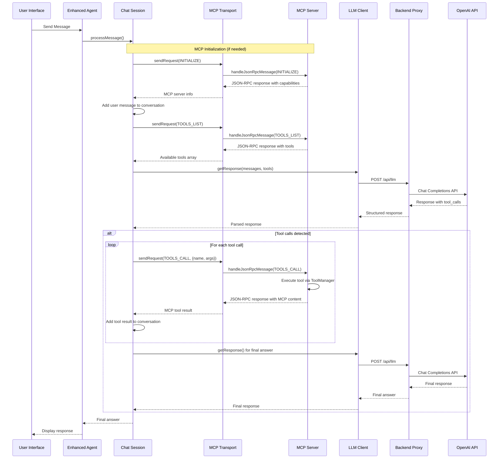

# MCP Browser Agent

A sophisticated React-based AI agent system that runs entirely in the browser using the Model Context Protocol (MCP). Features both single-agent and multi-agent modes with intelligent tool usage, real-time monitoring, and comprehensive error handling.

## 🚀 Quick Start

### Prerequisites

- **Node.js 18+** 
- **OpenAI API key** (required for AI functionality)

### Setup & Installation

1. **Clone and navigate to the project**:
   ```bash
   git clone <repository-url>
   cd mcp-browser-agent
   ```

2. **Install dependencies**:
   ```bash
   # Install backend dependencies
   cd backend
   npm install
   
   # Install frontend dependencies  
   cd ../frontend
   npm install
   cd ..
   ```

3. **Configure environment**:
   ```bash
   # Copy environment template
   cp backend/.env.example backend/.env
   
   # Edit backend/.env and add your OpenAI API key:
   # OPENAI_API_KEY=your_openai_api_key_here
   # PORT=3001
   ```

4. **Start the application**:
   ```bash
   # Terminal 1: Start backend server
   cd backend
   npm run dev
   
   # Terminal 2: Start frontend (in a new terminal)
   cd frontend  
   npm run dev
   ```

5. **Open your browser**: Navigate to **http://localhost:3000**

That's it! The agent is ready to use. Click "Start Agent" to begin interacting with the AI assistant.

## ✨ Key Features

### 🤖 **Dual Agent Modes**
- **Single Agent Mode**: Traditional one-on-one AI interaction
- **Multi-Agent Mode**: Run up to 5 AI agents simultaneously, each with independent conversations and contexts
- **Seamless Switching**: Toggle between modes without losing data

### 🔧 **Intelligent Tool System**
- **Safe Calculator**: Secure mathematical expression evaluator with sqrt, exponents, and complex operations
- **DOM Interaction**: Query, click, and manipulate webpage elements with text-based searching
- **Browser Storage**: Read/write to localStorage for persistent data
- **Tool Discovery**: Dynamic tool registration and real-time capability detection

### 🧠 **Advanced AI Capabilities**
- **MCP Standard Compliance**: Full OpenAI Chat Completions API compatibility
- **Context Management**: Smart conversation history with automatic trimming
- **Error Recovery**: Robust error handling with automatic fallback strategies
- **Real-time Processing**: Live tool execution with detailed activity logging

### 📊 **Monitoring & Debugging**
- **Activity Logs**: Real-time agent decision-making and tool execution logs
- **Performance Stats**: Execution counts, runtime metrics, and error tracking
- **LLM Debug Panel**: Detailed request/response monitoring for troubleshooting
- **Tool Visibility**: Live tool discovery and schema inspection

## 🏗️ Architecture

This system implements a **complete Model Context Protocol (MCP) architecture** entirely within the browser - a pioneering approach that maintains full MCP compliance while leveraging browser capabilities for optimal performance.

### Browser-Native MCP Implementation

```
┌─────────────────────────────────────────────────────────────┐
│                    Frontend (React)                         │
│                   Port: 3000                               │
│              ┌─────────────────────────────┐                │
│              │      MCP ARCHITECTURE       │                │
│              │                             │                │
│              │  ┌─────────┐  ┌───────────┐ │                │
│              │  │   MCP   │◄─┤    MCP    │ │                │
│              │  │  HOST   │  │  CLIENT   │ │                │
│              │  │         │  │           │ │                │
│              │  └─────────┘  └───────────┘ │                │
│              │       │              │     │                │
│              │       └──────┬───────┘     │                │
│              │              │             │                │
│              │       ┌─────────────┐      │                │
│              │       │ MCP SERVER  │      │                │
│              │       │             │      │                │
│              │       └─────────────┘      │                │
│              └─────────────────────────────┘                │
└─────────────────────┬───────────────────────────────────────┘
                      │ Proxy /api requests
┌─────────────────────▼───────────────────────────────────────┐
│                 Backend (Express)                           │
│                   Port: 3001                               │
│              Proxies to OpenAI API                         │
└─────────────────────────────────────────────────────────────┘

MCP Components:
├── MCP Host: Enhanced Agent System (mcp-host/)
├── MCP Client: Chat Session + LLM Client (mcp/, llm/)
├── MCP Server: Tool & Resource Management (mcp-server/)
├── Transport: In-Memory JSON-RPC Simulation (mcp/)
├── Multi-Agent Manager (components/)
└── Configuration Management (mcp-host/)
```

### MCP Protocol Compliance

✅ **Full Architecture Compliance**: Implements the official Host ↔ Client ↔ Server pattern  
✅ **Capability Negotiation**: Proper client/server capability exchange during initialization  
✅ **Design Principles**: Adheres to all 4 core MCP design principles  
✅ **Transport Innovation**: Uses optimized in-memory JSON-RPC simulation  
✅ **Security Boundaries**: Maintains proper isolation between MCP components  
✅ **Tool Discovery**: Dynamic tool registration and capability detection  
✅ **Resource Management**: Structured resource exposure and access control

## 🏛️ MCP Architecture in the Browser

### Complete MCP Implementation

This system implements a **full Model Context Protocol (MCP) architecture** entirely within the browser, including proper JSON-RPC communication between all components. This is a true MCP implementation that follows the official specification while running in a browser environment.

### MCP Component Mapping

According to the [official MCP specification](https://modelcontextprotocol.io/specification/2025-06-18/architecture), MCP follows a **Host ↔ Client ↔ Server** architecture. Here's how our browser implementation maps to these roles:

```
┌─────────────────────────────────────────────────────────────┐
│                      MCP HOST                               │
│              React App + Enhanced Agent                     │
│                                                             │
│  • Creates and manages MCP client                          │
│  • Controls connection permissions                         │
│  • Handles user authorization                              │
│  • Coordinates AI/LLM integration                          │
│  • Manages context aggregation                             │
│                                                             │
│  ┌─────────────────────┐    ┌─────────────────────────┐    │
│  │     MCP CLIENT      │◄──►│     MCP SERVER          │    │
│  │  MCPClient +        │    │  MCPServer              │    │
│  │  LLMClient          │    │                         │    │
│  │                     │    │  • Exposes tools        │    │
│  │  • Maintains        │    │  • Handles execution    │    │
│  │    stateful session │    │  • Manages resources    │    │
│  │  • Protocol         │    │  • Capability           │    │
│  │    negotiation      │    │    negotiation          │    │
│  │  • Message routing  │    │  • Security boundaries │    │
│  └─────────────────────┘    └─────────────────────────┘    │
└─────────────────────────────────────────────────────────────┘
                    Browser Process
```

#### **MCP Host** (`App.tsx` + `MCPHost.ts`)
- **Role**: Container and coordinator for the entire MCP ecosystem
- **Responsibilities**:
  - Creates and manages the MCP client instance
  - Controls client connection permissions and lifecycle
  - Enforces security policies and user consent
  - Handles user authorization decisions
  - Coordinates AI/LLM integration and sampling requests
  - Manages context aggregation across the system
  - Provides the user interface and interaction layer

#### **MCP Client** (`MCPClient.ts` + `LLMClient.ts`)
- **Role**: Protocol client maintaining 1:1 connection with MCP server
- **Responsibilities**:
  - Establishes stateful session with the MCP server
  - Handles protocol negotiation and capability exchange
  - Routes protocol messages bidirectionally
  - Manages subscriptions and notifications
  - Maintains security boundaries
  - Coordinates conversation flow and tool execution requests

#### **MCP Server** (`MCPServer.ts`)
- **Role**: Provides specialized context and capabilities
- **Responsibilities**:
  - Exposes resources, tools, and prompts via MCP primitives
  - Operates independently with focused responsibilities
  - Handles tool registration and execution
  - Manages capability negotiation
  - Maintains proper security constraints
  - Provides health monitoring and statistics

### JSON-RPC Implementation

The system now uses proper JSON-RPC communication between MCP components:

```typescript
// JSON-RPC initialization
await transport.sendRequest(MCPMethods.INITIALIZE, {
  protocolVersion: "2025-06-18",
  capabilities: { tools: {}, sampling: {} },
  clientInfo: { name: "mcp-browser-client", version: "1.0.0" }
});

// JSON-RPC tool calls
const mcpResult = await transport.sendRequest(MCPMethods.TOOLS_CALL, {
  name: toolCall.function.name,
  arguments: arguments_
});
```

#### **JSON-RPC Server Handler**
```typescript
// Server message handling
async handleJsonRpcMessage(request: JsonRpcRequest): Promise<JsonRpcResponse> {
  switch (request.method) {
    case MCPMethods.INITIALIZE:
      return await this.handleInitialize(request);
    case MCPMethods.TOOLS_LIST:
      return await this.handleToolsList(request);
    case MCPMethods.TOOLS_CALL:
      return await this.handleToolsCall(request);
  }
}
```

#### **Transport Implementation**
- **In-Memory JSON-RPC**: Simulates proper JSON-RPC with serialization/deserialization
- **Request/Response Correlation**: Unique request IDs for proper message matching
- **Error Handling**: Standard JSON-RPC error codes and MCP-specific errors
- **Comprehensive Logging**: Full request/response logging for debugging

#### **MCP Protocol Compliance**
- **Standard Methods**: Uses official MCP method names (`initialize`, `tools/list`, `tools/call`)
- **Capability Negotiation**: Proper client/server capability exchange
- **Protocol Version**: Correct "2025-06-18" version from official specification
- **Error Codes**: Standard JSON-RPC and MCP-specific error handling

### MCP Design Principles Compliance

The implementation already adheres to all core MCP design principles:

#### 1. **Servers are extremely easy to build**
```typescript
// Simple tool registration
const calculatorTool = createTool(
  'calculator',
  'Calculate mathematical expressions',
  schema,
  async (args) => {
    return { success: true, data: { result: evaluate(args.expression) } };
  }
);

mcpServer.registerTool(calculatorTool);
```

#### 2. **Servers are highly composable**
- Each tool operates independently
- Multiple tools combine seamlessly
- Shared protocol enables interoperability
- Modular design supports extensibility

#### 3. **Servers cannot read whole conversation**
- Server receives only tool execution requests
- Full conversation history stays with the client/host
- Each tool call is isolated
- Cross-tool interactions controlled by client

#### 4. **Progressive feature addition**
- Core protocol provides minimal functionality
- Additional capabilities negotiated as needed
- Tools can be added/removed dynamically
- Backwards compatibility maintained

### Browser MCP Advantages

#### **Performance Benefits**
- **Zero Network Latency**: In-memory JSON-RPC between components
- **Shared Memory**: Efficient data sharing within browser context
- **Minimal Serialization Overhead**: In-memory JSON-RPC simulation maintains performance

#### **Security Benefits**
- **Sandboxed Environment**: Browser security model provides isolation
- **No External Processes**: All components run in controlled environment
- **Direct DOM Access**: Tools can interact with page elements securely

#### **Development Benefits**
- **Unified Debugging**: All components debuggable in browser dev tools
- **Hot Reloading**: Development changes reflected immediately
- **Rich Tooling**: Browser debugging and profiling capabilities

### MCP vs Traditional Tool Calling

| Aspect | Traditional Function Calling | MCP Implementation |
|--------|------------------------------|-------------------|
| **Architecture** | Direct LLM ↔ Functions | Host ↔ Client ↔ Server |
| **Protocol** | Vendor-specific formats | Standardized MCP protocol |
| **Capability Discovery** | Static tool definitions | Dynamic capability negotiation |
| **Security** | Function-level isolation | Component-level boundaries |
| **Extensibility** | Monolithic tool sets | Composable server ecosystem |
| **Context Management** | LLM manages all context | Host coordinates context |

### Future Enhancements

#### **Multi-Server Support**
```typescript
// Multiple MCP servers
const fileServer = new FileMCPServer();
const apiServer = new APIMCPServer(); 
const dbServer = new DatabaseMCPServer();

// Host manages multiple client connections
host.addServer(fileServer);
host.addServer(apiServer);
host.addServer(dbServer);
```

#### **Advanced MCP Features**
- **Resource Subscriptions**: Real-time updates from MCP servers
- **Prompt Templates**: Reusable prompt templates from servers
- **Sampling**: Server-initiated LLM requests
- **Notifications**: Server-to-client event streaming

This browser-based implementation demonstrates a complete MCP architecture that maintains all the core benefits of composability, security, and extensibility while running entirely in the browser environment.

## 🔄 Agent Execution Flow

### High-Level System Flow

The MCP Browser Agent uses a sophisticated execution flow that follows the Model Context Protocol standard for tool calling. Here's how the system works:



### Message Processing Flow

When a user sends a message, here's the detailed step-by-step process:

#### 1. **Message Initiation**
```typescript
// User types message in UI
await agent.processMessage("Calculate sqrt(16) + 5")
```

#### 2. **Session Processing** (`ChatSession.processMessage()`)
- Add user message to conversation history
- Build system prompt with available tools
- Prepare messages array for LLM

#### 3. **Tool Discovery via JSON-RPC**
```typescript
// Get tools via JSON-RPC
const transport = getMCPTransport();
const toolsResponse = await transport.sendRequest(MCPMethods.TOOLS_LIST);

// Convert MCP tools to OpenAI function format
const tools = toolsResponse.tools.map(tool => ({
  type: "function",
  function: {
    name: tool.name,
    description: tool.description,
    parameters: tool.inputSchema
  }
}));
```
- Request tools from MCP server via JSON-RPC
- Convert MCP tool format to OpenAI function format
- Include tool schemas and descriptions for LLM decision-making

#### 4. **LLM Communication** (`LLMClient.getResponse()`)
```typescript
const llmResponse = await this.llmClient.getResponse(messages, {
  tools: tools.length > 0 ? tools : undefined
});
```

#### 5. **MCP Standard Processing**
The system follows OpenAI's Chat Completions API format:

**Request Format:**
```json
{
  "messages": [
    {"role": "system", "content": "You are an AI assistant..."},
    {"role": "user", "content": "Calculate sqrt(16) + 5"}
  ],
  "tools": [
    {
      "type": "function",
      "function": {
        "name": "calculator",
        "description": "Calculate mathematical expressions",
        "parameters": {...}
      }
    }
  ],
  "tool_choice": "auto"
}
```

**Response with Tool Calls:**
```json
{
  "choices": [{
    "message": {
      "role": "assistant",
      "content": null,
      "tool_calls": [
        {
          "id": "call_123",
          "type": "function",
          "function": {
            "name": "calculator",
            "arguments": "{\"expression\": \"sqrt(16) + 5\"}"
          }
        }
      ]
    }
  }]
}
```

#### 6. **Tool Execution via JSON-RPC** (`processLLMResponseMCP()`)
```typescript
// Execute each tool call via JSON-RPC
const transport = getMCPTransport();

for (const toolCall of llmResponse.tool_calls) {
  let arguments_: any;
  try {
    arguments_ = JSON.parse(toolCall.function.arguments);
  } catch (error) {
    arguments_ = {};
  }

  // Call tool via JSON-RPC
  const mcpResult = await transport.sendRequest(MCPMethods.TOOLS_CALL, {
    name: toolCall.function.name,
    arguments: arguments_
  });

  // Extract result from MCP response format
  let resultContent: string;
  if (mcpResult.content && mcpResult.content.length > 0) {
    const contentItem = mcpResult.content[0];
    resultContent = contentItem.text || JSON.stringify(contentItem.data, null, 2);
  } else {
    resultContent = mcpResult.isError ? 'Tool execution failed' : 'Tool executed successfully';
  }

  // Add tool result to conversation
  const toolMessage = {
    role: 'tool',
    tool_call_id: toolCall.id,
    name: toolCall.function.name,
    content: resultContent
  };
  
  this.context.messages.push(toolMessage);
}
```

#### 7. **Final Response Generation**
- Send updated conversation (including tool results) back to LLM
- LLM generates natural language response based on tool results
- Return final answer to user

### Tool Execution Flow

The tool execution system is designed for safety and reliability:

#### Tool Registration
```typescript
// Tools are registered at startup
const calculatorTool = createTool(
  'calculator',
  'Calculate mathematical expressions',
  schema,
  async (args) => {
    // Safe execution with validation
    return { success: true, data: { result: 9 } };
  }
);
```

#### Execution Pipeline
1. **Validation**: Check tool exists and parameters are valid
2. **Security**: Validate input parameters against schema
3. **Execution**: Run tool in isolated context
4. **Error Handling**: Catch and format any errors
5. **Result Formatting**: Return standardized result format

#### Tool Result Format
```typescript
interface ToolResult {
  success: boolean;
  data?: any;        // Tool output data
  error?: string;    // Error message if failed
}
```

### Multi-Agent Coordination

In multi-agent mode, the system efficiently manages multiple agents:

#### Resource Sharing Strategy
- **Shared Components**: ToolManager, MCPServer, LLMClient (stateless)
- **Individual Components**: ChatSession, conversation history, agent state
- **Benefits**: Efficient resource usage while maintaining agent isolation

#### Agent Lifecycle
```typescript
// Agent creation and management
const agentManager = createAgentManager(onLog);
const agentId = await agentManager.createAgent("Research Assistant");
await agentManager.startAgent(agentId);
const response = await agentManager.processMessage(agentId, "Hello");
```

#### Isolation Guarantees
- Each agent maintains separate conversation history
- Independent error handling and recovery
- Individual start/stop controls
- Separate activity logging

### Error Handling Flow

The system implements comprehensive error handling at every layer:

#### 1. **Tool Level Errors**
```typescript
try {
  const result = evaluator.evaluate(expression);
  return { success: true, data: { result } };
} catch (error) {
  return { success: false, error: error.message };
}
```

#### 2. **Session Level Errors**
- Automatic retry logic for transient failures
- Conversation history preservation during errors
- Graceful degradation when tools fail

#### 3. **LLM Level Errors**
- Request timeout handling (30s default)
- Network error recovery
- Fallback responses from backend

#### 4. **Agent Level Errors**
- Automatic session restart on critical errors
- Error count tracking with shutdown thresholds
- Comprehensive error logging

### Performance Optimizations

#### Message History Management
```typescript
// Automatic conversation trimming
private trimMessageHistory(): void {
  const maxMessages = 20;
  if (this.context.messages.length > maxMessages) {
    const systemMessage = this.context.messages[0];
    const recentMessages = this.context.messages.slice(-maxMessages + 1);
    this.context.messages = [systemMessage, ...recentMessages];
  }
}
```

#### Request Optimization
- Request deduplication and caching
- Timeout handling prevents hanging requests
- Retry logic with exponential backoff

#### Memory Management
- Singleton patterns prevent multiple instances
- Proper cleanup prevents memory leaks
- Context trimming keeps memory usage bounded

### Debugging and Monitoring

The system provides extensive debugging capabilities:

#### Real-time Monitoring
- **Activity Logs**: Every decision and tool execution
- **Performance Stats**: Execution counts, timing, error rates
- **LLM Debug Panel**: Full request/response inspection

#### Debug Information
```typescript
interface LLMDebugInfo {
  id: string;
  timestamp: number;
  requestPayload: any;
  responsePayload: any;
  duration: number;
  tokenUsage: TokenUsage;
}
```

This execution flow ensures reliable, efficient, and transparent AI agent operations while maintaining full compliance with the Model Context Protocol standard.

## 🔄 Multi-Step Problem Solving

### Iterative Tool Calling

One of the most powerful features of the MCP Browser Agent is its ability to **chain multiple tool calls together** to solve complex, multi-step problems. The agent doesn't just execute one tool and stop - it can analyze results and decide what to do next.

#### How It Works

The agent uses a **recursive processing pattern** that allows it to:

1. **Execute initial tools** based on user request
2. **Analyze tool results** to understand what was accomplished
3. **Determine next steps** needed to complete the task
4. **Execute additional tools** as needed
5. **Repeat until task is complete**

#### Real-World Example: Complex Web Interaction

**User Request**: *"Find the login form, fill it with username 'john' and password 'secret123', then click submit"*

**Agent Execution Flow**:

```
Step 1: 🔍 Find Login Form
├── Tool: dom_query(action="get_page_info")
├── Result: "Found login form with username and password fields"
└── Decision: "I can see the form, now I need to locate the username field"

Step 2: 📝 Fill Username Field  
├── Tool: dom_query(partialText="username", action="value", value="john")
├── Result: "Username field filled successfully"
└── Decision: "Username filled, now I need to find the password field"

Step 3: 🔐 Fill Password Field
├── Tool: dom_query(partialText="password", action="value", value="secret123")  
├── Result: "Password field filled successfully"
└── Decision: "Both fields filled, now I need to find and click submit"

Step 4: ✅ Submit Form
├── Tool: dom_query(partialText="submit", action="click")
├── Result: "Submit button clicked successfully"
└── Decision: "Task completed successfully"

Final Response: "I've successfully found the login form, filled in the username 'john' and password, then clicked the submit button. The login process is complete."
```

#### Mathematical Problem Solving

**User Request**: *"Calculate the area of a circle with radius 5, then store the result for later"*

**Agent Execution Flow**:

```
Step 1: 🧮 Calculate Circle Area
├── Tool: calculator(expression="3.14159 * 5^2")
├── Result: {"result": 78.53975}
└── Decision: "I have the area, now I should store it as requested"

Step 2: 💾 Store Result
├── Tool: browser_storage(action="set", key="circle_area_r5", value="78.53975")
├── Result: {"success": true}
└── Decision: "Value stored successfully, task complete"

Final Response: "I've calculated the area of a circle with radius 5 as 78.54 square units and stored this result in browser storage under the key 'circle_area_r5' for later use."
```

#### Error Recovery and Adaptation

The agent can also **adapt when tools don't work as expected**:

**User Request**: *"Click the 'Login' button"*

```
Step 1: 🎯 Try Direct Text Match
├── Tool: dom_query(textContent="Login", action="click")
├── Result: "No elements found matching the criteria"
└── Decision: "Exact match failed, let me try partial text search"

Step 2: 🔍 Try Partial Text Match
├── Tool: dom_query(partialText="login", action="click")
├── Result: "No elements found matching the criteria"  
└── Decision: "Text search failed, let me check what's actually on the page"

Step 3: 📋 Analyze Page Content
├── Tool: dom_query(action="get_page_info")
├── Result: "Found buttons: ['Sign In', 'Register', 'Forgot Password']"
└── Decision: "I see 'Sign In' which is likely the login button"

Step 4: ✅ Click Correct Button
├── Tool: dom_query(textContent="Sign In", action="click")
├── Result: "Button clicked successfully"
└── Decision: "Successfully found and clicked the login button"

Final Response: "I found and clicked the login button (labeled 'Sign In') after adapting my search strategy when the initial attempts didn't find an exact 'Login' button."
```

### Technical Implementation

The recursive tool calling is implemented in the `processLLMResponseMCP()` method:

```typescript
// After executing tool calls, check if more are needed
const finalResponse = await this.llmClient.getResponse(this.context.messages, {
  tools: tools.length > 0 ? tools : undefined
});

// If LLM decides more tools are needed, recursively process them
if (finalResponse.tool_calls && finalResponse.tool_calls.length > 0) {
  return await this.processLLMResponseMCP(finalResponse);
}
```

### Key Benefits

1. **Complex Task Completion**: Handle multi-step workflows automatically
2. **Adaptive Problem Solving**: Adjust strategy when initial approaches fail
3. **Context Awareness**: Each tool call builds on previous results
4. **Error Recovery**: Gracefully handle failures and try alternative approaches
5. **Natural Conversation**: Maintains conversational flow while executing multiple tools

### Conversation Context Building

Each tool execution adds to the conversation history, giving the LLM full context:

```json
[
  {"role": "user", "content": "Find and click the login button"},
  {"role": "assistant", "tool_calls": [{"function": {"name": "dom_query", "arguments": "{\"textContent\":\"Login\",\"action\":\"click\"}"}}]},
  {"role": "tool", "tool_call_id": "call_1", "content": "No elements found"},
  {"role": "assistant", "tool_calls": [{"function": {"name": "dom_query", "arguments": "{\"action\":\"get_page_info\"}"}}]},
  {"role": "tool", "tool_call_id": "call_2", "content": "Found buttons: ['Sign In', 'Register']"},
  {"role": "assistant", "tool_calls": [{"function": {"name": "dom_query", "arguments": "{\"textContent\":\"Sign In\",\"action\":\"click\"}"}}]},
  {"role": "tool", "tool_call_id": "call_3", "content": "Button clicked successfully"},
  {"role": "assistant", "content": "I successfully found and clicked the login button..."}
]
```

This rich conversation history allows the agent to make informed decisions about what tools to use next and how to adapt its approach based on previous results.

## 🔧 Available Tools

### Calculator
- **Purpose**: Safe arithmetic calculations with advanced functions
- **Features**: Addition, subtraction, multiplication, division, exponents (^), square root (sqrt)
- **Security**: Input validation, no dangerous `eval()` usage
- **Example**: `"Calculate sqrt(16) + 2^3"`

### DOM Query
- **Purpose**: Interact with webpage elements and content
- **Capabilities**: 
  - Click buttons/links by text or selector
  - Read/write element content and form values
  - Scroll pages and elements
  - Find elements by text, placeholder, or label
  - Get page information and structure
- **Example**: `"Click the button that says 'Submit'"`

### Browser Storage
- **Purpose**: Persistent data storage in the browser
- **Actions**: `get`, `set`, `remove`, `clear`, `keys`
- **Use Cases**: User preferences, temporary data, form persistence
- **Example**: `"Save my preference for dark mode"`

### Tool Discovery
- **Purpose**: Dynamic discovery of available capabilities
- **Returns**: Complete tool list with descriptions and schemas
- **Usage**: Automatically called when users ask "what can you do?"

## 🎯 Usage Examples

### Single Agent Mode
1. Click "▶️ Start Agent" to initialize the AI
2. Type questions or requests in the chat interface
3. Watch real-time tool execution in the activity log
4. Monitor performance statistics in the sidebar

### Multi-Agent Mode
1. Click "Switch to Multi-Agent Mode" 
2. Create multiple agents with custom names
3. Switch between agent tabs for independent conversations
4. Start/stop agents individually as needed
5. Each agent maintains separate context and history

### Example Interactions
- **Math**: "Calculate the square root of 144 plus 5 times 3"
- **Web Interaction**: "Click the login button and fill in the username field"
- **Data Storage**: "Remember that my favorite color is blue"
- **Tool Discovery**: "What tools do you have available?"

## 🛠️ Development

### Project Structure & Core Functionality

```
mcp-browser-agent/
├── backend/                 # Express.js API server
│   ├── index.js            # Main server with OpenAI proxy
│   ├── package.json        # Backend dependencies
│   └── .env.example        # Environment template
├── frontend/               # React application
│   ├── src/
│   │   ├── mcp/            # 🔌 MCP Protocol Layer
│   │   │   ├── MCPProtocol.ts    # Protocol definitions & JSON-RPC methods
│   │   │   ├── MCPTransport.ts   # In-memory JSON-RPC transport simulation
│   │   │   └── MCPClient.ts      # Session orchestrator & conversation manager
│   │   ├── mcp-host/       # 🏠 MCP Host Implementation  
│   │   │   ├── HostConfiguration.ts  # Centralized config management
│   │   │   ├── MCPHost.ts        # Main agent orchestrator & lifecycle
│   │   │   └── HostManager.ts    # Multi-agent management system
│   │   ├── mcp-server/     # 🛠️ MCP Server Implementation
│   │   │   ├── MCPServer.ts      # Tool & resource server
│   │   │   ├── ToolRegistry.ts   # Tool registration & execution engine
│   │   │   ├── ServerTools.ts    # Built-in tool implementations
│   │   │   └── Tool.ts           # Tool abstraction & validation framework
│   │   ├── components/     # 🎨 UI Components
│   │   │   ├── MCPHostInterface.tsx  # Multi-agent interface
│   │   │   ├── MCPDebugPanel.tsx     # Debug & monitoring panel
│   │   │   └── TokenUsageDisplay.tsx # Token usage tracking
│   │   ├── llm/           # 🧠 LLM client with error handling
│   │   ├── debug/         # 📊 Debug and monitoring
│   │   └── App.tsx        # Main application entry point
│   ├── package.json       # Frontend dependencies
│   └── vite.config.ts     # Vite configuration
└── README.md              # This file
```

## 🏗️ Detailed Architecture & File Functionality

### 🔌 **MCP Protocol Layer** (`frontend/src/mcp/`)

#### **MCPProtocol.ts** - Protocol Definitions
```typescript
// Core MCP protocol constants and types
export const MCPMethods = {
  INITIALIZE: 'initialize',
  TOOLS_LIST: 'tools/list', 
  TOOLS_CALL: 'tools/call'
} as const;

// JSON-RPC message structures for MCP communication
export interface JsonRpcRequest {
  jsonrpc: '2.0';
  id: string | number;
  method: string;
  params?: any;
}
```
**Core Functionality:**
- Defines official MCP protocol methods and message formats
- Implements JSON-RPC 2.0 specification for MCP communication
- Provides type safety for all MCP protocol interactions
- Ensures compliance with MCP specification version 2025-06-18

#### **MCPTransport.ts** - In-Memory JSON-RPC Transport
```typescript
// Simulates proper JSON-RPC communication between MCP components
export class MCPTransport {
  async sendRequest(method: string, params?: any): Promise<any> {
    // Serializes request, routes to server, deserializes response
    // Maintains proper JSON-RPC correlation and error handling
  }
}
```
**Core Functionality:**
- Simulates network JSON-RPC transport entirely in browser memory
- Maintains request/response correlation with unique IDs
- Provides proper error handling with standard JSON-RPC error codes
- Enables true MCP protocol compliance without network overhead
- Logs all requests/responses for debugging and monitoring

#### **MCPClient.ts** - Session Orchestrator & Conversation Manager
```typescript
export class MCPClient {
  async processMessage(userMessage: string): Promise<string> {
    // 1. Add user message to conversation history
    // 2. Get available tools via JSON-RPC from MCP server
    // 3. Send conversation + tools to LLM
    // 4. Execute any tool calls via JSON-RPC
    // 5. Get final response from LLM
    // 6. Return natural language response
  }
}
```
**Core Functionality:**
- **Conversation Management**: Maintains full conversation history with automatic trimming
- **MCP Protocol Orchestration**: Handles JSON-RPC communication with MCP server
- **Tool Execution Flow**: Coordinates between LLM decisions and tool execution
- **Error Recovery**: Comprehensive error handling with session recovery
- **Context Management**: Smart message history management and context preservation
- **Debug Integration**: Full integration with debug event system for monitoring

### 🏠 **MCP Host Implementation** (`frontend/src/mcp-host/`)

#### **HostConfiguration.ts** - Centralized Configuration Management
```typescript
export class Configuration {
  get llmConfig(): LLMConfig {
    return {
      model: "gpt-4.1-mini",
      temperature: 0.3,
      maxTokens: 1000,
      timeout: 30000
    };
  }
  
  get serverConfig(): ServerConfig {
    return {
      name: "browser-mcp-server",
      version: "1.0.0", 
      protocolVersion: "2025-06-18",
      capabilities: {
        tools: { listChanged: true },
        resources: { subscribe: true, listChanged: true }
      }
    };
  }
}
```
**Core Functionality:**
- **Singleton Pattern**: Ensures consistent configuration across entire application
- **Environment Integration**: Loads from environment variables with fallbacks
- **MCP Compliance**: Proper protocol version and capability configuration
- **Validation**: Comprehensive configuration validation with helpful error messages
- **Runtime Updates**: Support for dynamic configuration reloading
- **API Endpoints**: Centralized endpoint configuration for backend communication

#### **MCPHost.ts** - Main Agent Orchestrator & Lifecycle Manager
```typescript
export class MCPHost {
  async start(): Promise<void> {
    // 1. Initialize MCP server with tools
    // 2. Validate LLM client configuration  
    // 3. Create and start MCP client session
    // 4. Set up error handling and monitoring
    // 5. Log system summary and health status
  }
  
  async processMessage(message: string): Promise<string> {
    // Delegates to MCPClient for actual processing
    return await this.mcpClient.processMessage(message);
  }
}
```
**Core Functionality:**
- **System Orchestration**: Coordinates all MCP components (Host ↔ Client ↔ Server)
- **Lifecycle Management**: Handles startup, shutdown, and restart sequences
- **Health Monitoring**: Continuous system health checks and statistics
- **Error Handling**: Multi-layer error handling with automatic recovery
- **Resource Management**: Proper initialization and cleanup of all components
- **Statistics Tracking**: Comprehensive execution metrics and performance monitoring

#### **HostManager.ts** - Multi-Agent Management System
```typescript
export class AgentManager {
  async createAgent(name?: string): Promise<string> {
    // Creates new isolated agent instance with unique ID
    // Each agent has independent conversation and context
  }
  
  async processMessage(agentId: string, message: string): Promise<string> {
    // Routes message to specific agent instance
    // Maintains complete isolation between agents
  }
}
```
**Core Functionality:**
- **Multi-Agent Orchestration**: Manages up to 5 independent AI agents simultaneously
- **Agent Isolation**: Each agent maintains separate conversation history and context
- **Resource Sharing**: Efficient sharing of tools and LLM client across agents
- **Agent Lifecycle**: Individual start/stop/restart controls for each agent
- **State Management**: Persistent agent state with proper cleanup
- **Performance Optimization**: Shared infrastructure with isolated execution contexts

### 🛠️ **MCP Server Implementation** (`frontend/src/mcp-server/`)

#### **MCPServer.ts** - Tool & Resource Server
```typescript
export class MCPServer {
  async handleJsonRpcMessage(request: JsonRpcRequest): Promise<JsonRpcResponse> {
    switch (request.method) {
      case MCPMethods.INITIALIZE:
        return await this.handleInitialize(request);
      case MCPMethods.TOOLS_LIST:
        return await this.handleToolsList(request);
      case MCPMethods.TOOLS_CALL:
        return await this.handleToolsCall(request);
    }
  }
}
```
**Core Functionality:**
- **JSON-RPC Server**: Handles all MCP protocol requests with proper response formatting
- **Tool Management**: Registration, discovery, and execution of tools
- **Capability Negotiation**: Proper MCP capability exchange during initialization
- **Resource Management**: Manages tools, resources, and server state
- **Health Monitoring**: Server health checks and performance metrics
- **Security**: Input validation and safe tool execution environment

#### **ToolRegistry.ts** - Tool Registration & Execution Engine
```typescript
export class ToolRegistry {
  async executeTool(name: string, parameters: any): Promise<ToolResult> {
    // 1. Validate tool exists and parameters are correct
    // 2. Execute tool in isolated context with error handling
    // 3. Record execution in history with timing and results
    // 4. Return standardized result format
  }
  
  getExecutionStats(): ExecutionStats {
    // Comprehensive statistics: success/failure rates, timing, usage patterns
  }
}
```
**Core Functionality:**
- **Tool Registration**: Dynamic tool registration with validation and conflict detection
- **Execution Engine**: Safe tool execution with comprehensive error handling
- **History Tracking**: Complete execution history with timing and result tracking
- **Statistics**: Detailed execution statistics and performance metrics
- **Search & Discovery**: Tool search by name, description, and capabilities
- **MCP Integration**: Converts tools to MCP standard format for LLM consumption

#### **ServerTools.ts** - Built-in Tool Implementations
```typescript
// Calculator Tool - Safe mathematical expression evaluation
export const calculatorTool = createTool(
  'calculator',
  'Calculate mathematical expressions safely',
  schema,
  async (args) => {
    const evaluator = new SafeMathEvaluator();
    return { success: true, data: { result: evaluator.evaluate(args.expression) } };
  }
);

// DOM Query Tool - Comprehensive webpage interaction
export const domQueryTool = createTool(
  'dom_query', 
  'Interact with webpage elements and content',
  schema,
  async (args) => {
    // Supports: clicking, form filling, text reading, scrolling, content manipulation
    // Advanced text-based element finding with fallback strategies
  }
);
```
**Core Functionality:**
- **Calculator Tool**: Safe mathematical expression evaluation with sqrt, exponents, validation
- **DOM Query Tool**: Comprehensive webpage interaction (click, fill, read, scroll, manipulate)
- **Browser Storage Tool**: Persistent data storage with localStorage integration
- **List Tools Tool**: Dynamic tool discovery and capability reporting
- **Advanced Element Finding**: Text-based element location with intelligent fallbacks
- **Safety Validation**: Input validation and security checks for all operations

#### **Tool.ts** - Tool Abstraction & Validation Framework
```typescript
export function createTool(
  name: string,
  description: string, 
  inputSchema: any,
  handler: ToolHandler,
  title?: string
): Tool {
  return new Tool(name, description, inputSchema, handler, title);
}

export class Tool {
  validate(): { valid: boolean; errors: string[] } {
    // Comprehensive validation of tool definition and schema
  }
  
  async execute(parameters: any): Promise<ToolResult> {
    // Safe execution with parameter validation and error handling
  }
}
```
**Core Functionality:**
- **Tool Abstraction**: Unified interface for all tool implementations
- **Schema Validation**: JSON Schema validation for tool parameters
- **Error Handling**: Comprehensive error handling with detailed error messages
- **Result Standardization**: Consistent result format across all tools
- **Metadata Management**: Tool metadata, descriptions, and capability information
- **Execution Safety**: Safe execution environment with timeout and error recovery

### 🎨 **UI Components** (`frontend/src/components/`)

#### **MCPHostInterface.tsx** - Multi-Agent Interface
```typescript
function MultiAgentInterface() {
  // Manages multiple agent tabs with independent conversations
  // Real-time agent status monitoring and controls
  // Per-agent activity logs and performance metrics
}
```
**Core Functionality:**
- **Multi-Agent UI**: Tabbed interface for managing multiple AI agents
- **Independent Conversations**: Separate chat history and context per agent
- **Agent Controls**: Individual start/stop/rename/remove controls
- **Real-time Monitoring**: Live agent status and activity indicators
- **Resource Sharing**: Efficient UI updates with shared infrastructure

#### **MCPDebugPanel.tsx** - Debug & Monitoring Panel
```typescript
function EnhancedDebugPanel({ conversationFlows, isVisible, onToggle }) {
  // Real-time conversation flow visualization
  // LLM request/response monitoring with raw data
  // Tool execution tracking with timing and results
}
```
**Core Functionality:**
- **Conversation Flow Tracking**: Visual representation of conversation progression
- **LLM Debug Monitoring**: Complete request/response logging with raw data
- **Tool Execution Tracking**: Detailed tool execution logs with timing
- **Performance Metrics**: Real-time performance and error rate monitoring
- **Debug Event Integration**: Full integration with debug event system

### 🧠 **LLM Client** (`frontend/src/llm/`)

#### **LLMClient.ts** - Enhanced LLM Communication
```typescript
export class LLMClient {
  async getResponse(messages: Message[], options?: LLMRequestOptions): Promise<LLMResponse> {
    // 1. Validate configuration and messages
    // 2. Build request with tools and parameters
    // 3. Send to backend proxy with timeout handling
    // 4. Parse response and extract tool calls
    // 5. Return structured response with debug info
  }
}
```
**Core Functionality:**
- **OpenAI Integration**: Full Chat Completions API support with function calling
- **Error Handling**: Comprehensive error handling with retry logic and fallbacks
- **Debug Integration**: Complete request/response logging for debugging
- **Tool Call Parsing**: Proper parsing and validation of LLM tool calls
- **Performance Monitoring**: Request timing and token usage tracking
- **Backend Proxy**: Secure API key handling through backend proxy

### Adding Custom Tools

Create new tools using the enhanced tool abstraction:

```typescript
import { createTool } from './mcp-server/Tool';

const myCustomTool = createTool(
  'my_tool',
  'Description of what this tool does',
  {
    type: 'object',
    properties: {
      input: { type: 'string', description: 'Input parameter' }
    },
    required: ['input']
  },
  async (args) => {
    // Tool implementation
    return { success: true, data: { result: 'success' } };
  }
);

// Register in mcp-server/ServerTools.ts
export const enhancedTools = [
  // ... existing tools
  myCustomTool
];
```

### Configuration

The system uses centralized configuration management:

- **Backend**: Environment variables in `.env` file
- **Frontend**: Vite environment variables (optional, uses backend proxy)
- **Runtime**: Dynamic configuration through `Configuration` class

### API Endpoints

- **POST /api/llm**: LLM proxy with MCP function calling support
- **GET /api/health**: Health check and configuration status

## 🔍 Troubleshooting

### Common Issues

1. **"Failed to start agent"**
   - Check that backend is running on port 3001
   - Verify OpenAI API key is set in `backend/.env`
   - Check browser console for detailed error messages

2. **"No tools available"**
   - Ensure frontend can reach backend (check proxy configuration)
   - Verify MCP server initialization in browser console

3. **"API errors"**
   - Confirm OpenAI API key is valid and has sufficient credits
   - Check network connectivity
   - Review backend logs for detailed error information

### Debug Features

- **LLM Debug Panel**: Toggle to see all API requests/responses
- **Activity Logs**: Real-time agent decision-making process
- **Browser Console**: Detailed error messages and system status
- **Health Endpoint**: Visit http://localhost:3001/api/health for backend status

## 🚀 Advanced Features

### Multi-Agent Capabilities
- **Independent Contexts**: Each agent maintains separate conversation history
- **Shared Resources**: All agents use the same tool infrastructure efficiently
- **Individual Controls**: Start, stop, rename, and remove agents independently
- **Real-time Monitoring**: Per-agent activity logs and status indicators

### Enhanced Architecture
- **Layered Design**: Clear separation between UI, agent logic, tools, and LLM communication
- **Error Resilience**: Comprehensive error handling at every layer
- **Resource Management**: Proper initialization, cleanup, and memory management
- **Type Safety**: Full TypeScript implementation with strict typing

### MCP Standard Compliance
- **OpenAI Format**: Standard Chat Completions API with function calling
- **Tool Discovery**: Dynamic tool registration and capability negotiation
- **Message Flow**: Proper conversation flow with tool result integration
- **Protocol Compliance**: Full MCP specification adherence

## 📄 License

MIT License - see LICENSE file for details.

## 🙏 Acknowledgments

- **Model Context Protocol (MCP)** for the standard specification
- **OpenAI** for LLM capabilities and API
- **React & Vite** for the modern frontend framework
- **Express.js** for the robust backend server

---

**Ready to explore AI-powered browser automation?** Start with the Quick Start guide above and begin building intelligent web interactions! 🤖✨
