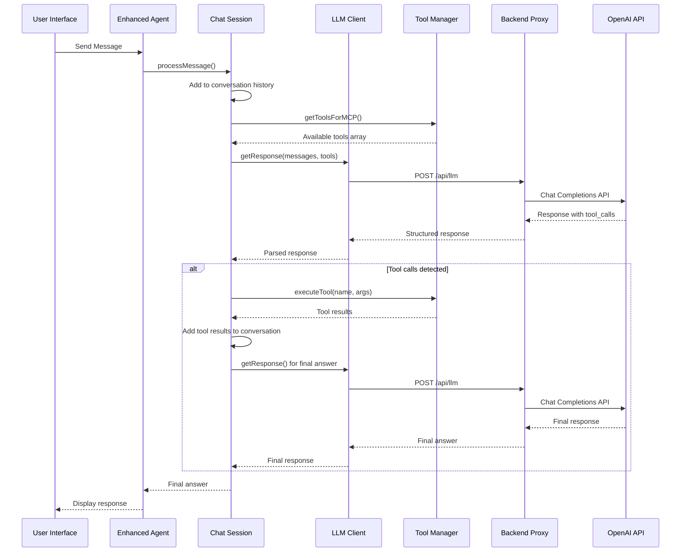

# MCP Browser Agent

A sophisticated React-based AI agent system that runs entirely in the browser using the Model Context Protocol (MCP). Features both single-agent and multi-agent modes with intelligent tool usage, real-time monitoring, and comprehensive error handling.

## 🚀 Quick Start

### Prerequisites

- **Node.js 18+** 
- **OpenAI API key** (required for AI functionality)

### Setup & Installation

1. **Clone and navigate to the project**:
   ```bash
   git clone <repository-url>
   cd mcp-browser-agent
   ```

2. **Install dependencies**:
   ```bash
   # Install backend dependencies
   cd backend
   npm install
   
   # Install frontend dependencies  
   cd ../frontend
   npm install
   cd ..
   ```

3. **Configure environment**:
   ```bash
   # Copy environment template
   cp backend/.env.example backend/.env
   
   # Edit backend/.env and add your OpenAI API key:
   # OPENAI_API_KEY=your_openai_api_key_here
   # PORT=3001
   ```

4. **Start the application**:
   ```bash
   # Terminal 1: Start backend server
   cd backend
   npm run dev
   
   # Terminal 2: Start frontend (in a new terminal)
   cd frontend  
   npm run dev
   ```

5. **Open your browser**: Navigate to **http://localhost:3000**

That's it! The agent is ready to use. Click "Start Agent" to begin interacting with the AI assistant.

## ✨ Key Features

### 🤖 **Dual Agent Modes**
- **Single Agent Mode**: Traditional one-on-one AI interaction
- **Multi-Agent Mode**: Run up to 5 AI agents simultaneously, each with independent conversations and contexts
- **Seamless Switching**: Toggle between modes without losing data

### 🔧 **Intelligent Tool System**
- **Safe Calculator**: Secure mathematical expression evaluator with sqrt, exponents, and complex operations
- **DOM Interaction**: Query, click, and manipulate webpage elements with text-based searching
- **Browser Storage**: Read/write to localStorage for persistent data
- **Tool Discovery**: Dynamic tool registration and real-time capability detection

### 🧠 **Advanced AI Capabilities**
- **MCP Standard Compliance**: Full OpenAI Chat Completions API compatibility
- **Context Management**: Smart conversation history with automatic trimming
- **Error Recovery**: Robust error handling with automatic fallback strategies
- **Real-time Processing**: Live tool execution with detailed activity logging

### 📊 **Monitoring & Debugging**
- **Activity Logs**: Real-time agent decision-making and tool execution logs
- **Performance Stats**: Execution counts, runtime metrics, and error tracking
- **LLM Debug Panel**: Detailed request/response monitoring for troubleshooting
- **Tool Visibility**: Live tool discovery and schema inspection

## 🏗️ Architecture

The system uses a modern layered architecture with clear separation of concerns:

```
┌─────────────────────────────────────────────────────────────┐
│                    Frontend (React)                         │
│                   Port: 3000                               │
└─────────────────────┬───────────────────────────────────────┘
                      │ Proxy /api requests
┌─────────────────────▼───────────────────────────────────────┐
│                 Backend (Express)                           │
│                   Port: 3001                               │
│              Proxies to OpenAI API                         │
└─────────────────────────────────────────────────────────────┘

Frontend Components:
├── Enhanced Agent System (agent/)
├── Multi-Agent Manager (components/)
├── MCP Server Implementation (server/)
├── Tool Management (tools/)
├── LLM Client (llm/)
├── Chat Session Management (session/)
└── Configuration Management (config/)
```

## 🔄 Agent Execution Flow

### High-Level System Flow

The MCP Browser Agent uses a sophisticated execution flow that follows the Model Context Protocol standard for tool calling. Here's how the system works:



### Message Processing Flow

When a user sends a message, here's the detailed step-by-step process:

#### 1. **Message Initiation**
```typescript
// User types message in UI
await agent.processMessage("Calculate sqrt(16) + 5")
```

#### 2. **Session Processing** (`ChatSession.processMessage()`)
- Add user message to conversation history
- Build system prompt with available tools
- Prepare messages array for LLM

#### 3. **Tool Discovery** (`ToolManager.getToolsForMCP()`)
- Convert all available tools to OpenAI function format
- Include tool schemas and descriptions
- Return tools array for LLM decision-making

#### 4. **LLM Communication** (`LLMClient.getResponse()`)
```typescript
const llmResponse = await this.llmClient.getResponse(messages, {
  tools: tools.length > 0 ? tools : undefined
});
```

#### 5. **MCP Standard Processing**
The system follows OpenAI's Chat Completions API format:

**Request Format:**
```json
{
  "messages": [
    {"role": "system", "content": "You are an AI assistant..."},
    {"role": "user", "content": "Calculate sqrt(16) + 5"}
  ],
  "tools": [
    {
      "type": "function",
      "function": {
        "name": "calculator",
        "description": "Calculate mathematical expressions",
        "parameters": {...}
      }
    }
  ],
  "tool_choice": "auto"
}
```

**Response with Tool Calls:**
```json
{
  "choices": [{
    "message": {
      "role": "assistant",
      "content": null,
      "tool_calls": [
        {
          "id": "call_123",
          "type": "function",
          "function": {
            "name": "calculator",
            "arguments": "{\"expression\": \"sqrt(16) + 5\"}"
          }
        }
      ]
    }
  }]
}
```

#### 6. **Tool Execution** (`processLLMResponseMCP()`)
```typescript
// Execute each tool call
for (const toolCall of llmResponse.tool_calls) {
  const result = await this.toolManager.executeTool(
    toolCall.function.name, 
    JSON.parse(toolCall.function.arguments)
  );
  
  // Add tool result to conversation
  const toolMessage = {
    role: 'tool',
    tool_call_id: toolCall.id,
    name: toolCall.function.name,
    content: JSON.stringify(result.data)
  };
  
  this.context.messages.push(toolMessage);
}
```

#### 7. **Final Response Generation**
- Send updated conversation (including tool results) back to LLM
- LLM generates natural language response based on tool results
- Return final answer to user

### Tool Execution Flow

The tool execution system is designed for safety and reliability:

#### Tool Registration
```typescript
// Tools are registered at startup
const calculatorTool = createTool(
  'calculator',
  'Calculate mathematical expressions',
  schema,
  async (args) => {
    // Safe execution with validation
    return { success: true, data: { result: 9 } };
  }
);
```

#### Execution Pipeline
1. **Validation**: Check tool exists and parameters are valid
2. **Security**: Validate input parameters against schema
3. **Execution**: Run tool in isolated context
4. **Error Handling**: Catch and format any errors
5. **Result Formatting**: Return standardized result format

#### Tool Result Format
```typescript
interface ToolResult {
  success: boolean;
  data?: any;        // Tool output data
  error?: string;    // Error message if failed
}
```

### Multi-Agent Coordination

In multi-agent mode, the system efficiently manages multiple agents:

#### Resource Sharing Strategy
- **Shared Components**: ToolManager, MCPServer, LLMClient (stateless)
- **Individual Components**: ChatSession, conversation history, agent state
- **Benefits**: Efficient resource usage while maintaining agent isolation

#### Agent Lifecycle
```typescript
// Agent creation and management
const agentManager = createAgentManager(onLog);
const agentId = await agentManager.createAgent("Research Assistant");
await agentManager.startAgent(agentId);
const response = await agentManager.processMessage(agentId, "Hello");
```

#### Isolation Guarantees
- Each agent maintains separate conversation history
- Independent error handling and recovery
- Individual start/stop controls
- Separate activity logging

### Error Handling Flow

The system implements comprehensive error handling at every layer:

#### 1. **Tool Level Errors**
```typescript
try {
  const result = evaluator.evaluate(expression);
  return { success: true, data: { result } };
} catch (error) {
  return { success: false, error: error.message };
}
```

#### 2. **Session Level Errors**
- Automatic retry logic for transient failures
- Conversation history preservation during errors
- Graceful degradation when tools fail

#### 3. **LLM Level Errors**
- Request timeout handling (30s default)
- Network error recovery
- Fallback responses from backend

#### 4. **Agent Level Errors**
- Automatic session restart on critical errors
- Error count tracking with shutdown thresholds
- Comprehensive error logging

### Performance Optimizations

#### Message History Management
```typescript
// Automatic conversation trimming
private trimMessageHistory(): void {
  const maxMessages = 20;
  if (this.context.messages.length > maxMessages) {
    const systemMessage = this.context.messages[0];
    const recentMessages = this.context.messages.slice(-maxMessages + 1);
    this.context.messages = [systemMessage, ...recentMessages];
  }
}
```

#### Request Optimization
- Request deduplication and caching
- Timeout handling prevents hanging requests
- Retry logic with exponential backoff

#### Memory Management
- Singleton patterns prevent multiple instances
- Proper cleanup prevents memory leaks
- Context trimming keeps memory usage bounded

### Debugging and Monitoring

The system provides extensive debugging capabilities:

#### Real-time Monitoring
- **Activity Logs**: Every decision and tool execution
- **Performance Stats**: Execution counts, timing, error rates
- **LLM Debug Panel**: Full request/response inspection

#### Debug Information
```typescript
interface LLMDebugInfo {
  id: string;
  timestamp: number;
  requestPayload: any;
  responsePayload: any;
  duration: number;
  tokenUsage: TokenUsage;
}
```

This execution flow ensures reliable, efficient, and transparent AI agent operations while maintaining full compliance with the Model Context Protocol standard.

## 🔄 Multi-Step Problem Solving

### Iterative Tool Calling

One of the most powerful features of the MCP Browser Agent is its ability to **chain multiple tool calls together** to solve complex, multi-step problems. The agent doesn't just execute one tool and stop - it can analyze results and decide what to do next.

#### How It Works

The agent uses a **recursive processing pattern** that allows it to:

1. **Execute initial tools** based on user request
2. **Analyze tool results** to understand what was accomplished
3. **Determine next steps** needed to complete the task
4. **Execute additional tools** as needed
5. **Repeat until task is complete**

#### Real-World Example: Complex Web Interaction

**User Request**: *"Find the login form, fill it with username 'john' and password 'secret123', then click submit"*

**Agent Execution Flow**:

```
Step 1: 🔍 Find Login Form
├── Tool: dom_query(action="get_page_info")
├── Result: "Found login form with username and password fields"
└── Decision: "I can see the form, now I need to locate the username field"

Step 2: 📝 Fill Username Field  
├── Tool: dom_query(partialText="username", action="value", value="john")
├── Result: "Username field filled successfully"
└── Decision: "Username filled, now I need to find the password field"

Step 3: 🔐 Fill Password Field
├── Tool: dom_query(partialText="password", action="value", value="secret123")  
├── Result: "Password field filled successfully"
└── Decision: "Both fields filled, now I need to find and click submit"

Step 4: ✅ Submit Form
├── Tool: dom_query(partialText="submit", action="click")
├── Result: "Submit button clicked successfully"
└── Decision: "Task completed successfully"

Final Response: "I've successfully found the login form, filled in the username 'john' and password, then clicked the submit button. The login process is complete."
```

#### Mathematical Problem Solving

**User Request**: *"Calculate the area of a circle with radius 5, then store the result for later"*

**Agent Execution Flow**:

```
Step 1: 🧮 Calculate Circle Area
├── Tool: calculator(expression="3.14159 * 5^2")
├── Result: {"result": 78.53975}
└── Decision: "I have the area, now I should store it as requested"

Step 2: 💾 Store Result
├── Tool: browser_storage(action="set", key="circle_area_r5", value="78.53975")
├── Result: {"success": true}
└── Decision: "Value stored successfully, task complete"

Final Response: "I've calculated the area of a circle with radius 5 as 78.54 square units and stored this result in browser storage under the key 'circle_area_r5' for later use."
```

#### Error Recovery and Adaptation

The agent can also **adapt when tools don't work as expected**:

**User Request**: *"Click the 'Login' button"*

```
Step 1: 🎯 Try Direct Text Match
├── Tool: dom_query(textContent="Login", action="click")
├── Result: "No elements found matching the criteria"
└── Decision: "Exact match failed, let me try partial text search"

Step 2: 🔍 Try Partial Text Match
├── Tool: dom_query(partialText="login", action="click")
├── Result: "No elements found matching the criteria"  
└── Decision: "Text search failed, let me check what's actually on the page"

Step 3: 📋 Analyze Page Content
├── Tool: dom_query(action="get_page_info")
├── Result: "Found buttons: ['Sign In', 'Register', 'Forgot Password']"
└── Decision: "I see 'Sign In' which is likely the login button"

Step 4: ✅ Click Correct Button
├── Tool: dom_query(textContent="Sign In", action="click")
├── Result: "Button clicked successfully"
└── Decision: "Successfully found and clicked the login button"

Final Response: "I found and clicked the login button (labeled 'Sign In') after adapting my search strategy when the initial attempts didn't find an exact 'Login' button."
```

### Technical Implementation

The recursive tool calling is implemented in the `processLLMResponseMCP()` method:

```typescript
// After executing tool calls, check if more are needed
const finalResponse = await this.llmClient.getResponse(this.context.messages, {
  tools: tools.length > 0 ? tools : undefined
});

// If LLM decides more tools are needed, recursively process them
if (finalResponse.tool_calls && finalResponse.tool_calls.length > 0) {
  return await this.processLLMResponseMCP(finalResponse);
}
```

### Key Benefits

1. **Complex Task Completion**: Handle multi-step workflows automatically
2. **Adaptive Problem Solving**: Adjust strategy when initial approaches fail
3. **Context Awareness**: Each tool call builds on previous results
4. **Error Recovery**: Gracefully handle failures and try alternative approaches
5. **Natural Conversation**: Maintains conversational flow while executing multiple tools

### Conversation Context Building

Each tool execution adds to the conversation history, giving the LLM full context:

```json
[
  {"role": "user", "content": "Find and click the login button"},
  {"role": "assistant", "tool_calls": [{"function": {"name": "dom_query", "arguments": "{\"textContent\":\"Login\",\"action\":\"click\"}"}}]},
  {"role": "tool", "tool_call_id": "call_1", "content": "No elements found"},
  {"role": "assistant", "tool_calls": [{"function": {"name": "dom_query", "arguments": "{\"action\":\"get_page_info\"}"}}]},
  {"role": "tool", "tool_call_id": "call_2", "content": "Found buttons: ['Sign In', 'Register']"},
  {"role": "assistant", "tool_calls": [{"function": {"name": "dom_query", "arguments": "{\"textContent\":\"Sign In\",\"action\":\"click\"}"}}]},
  {"role": "tool", "tool_call_id": "call_3", "content": "Button clicked successfully"},
  {"role": "assistant", "content": "I successfully found and clicked the login button..."}
]
```

This rich conversation history allows the agent to make informed decisions about what tools to use next and how to adapt its approach based on previous results.

## 🔧 Available Tools

### Calculator
- **Purpose**: Safe arithmetic calculations with advanced functions
- **Features**: Addition, subtraction, multiplication, division, exponents (^), square root (sqrt)
- **Security**: Input validation, no dangerous `eval()` usage
- **Example**: `"Calculate sqrt(16) + 2^3"`

### DOM Query
- **Purpose**: Interact with webpage elements and content
- **Capabilities**: 
  - Click buttons/links by text or selector
  - Read/write element content and form values
  - Scroll pages and elements
  - Find elements by text, placeholder, or label
  - Get page information and structure
- **Example**: `"Click the button that says 'Submit'"`

### Browser Storage
- **Purpose**: Persistent data storage in the browser
- **Actions**: `get`, `set`, `remove`, `clear`, `keys`
- **Use Cases**: User preferences, temporary data, form persistence
- **Example**: `"Save my preference for dark mode"`

### Tool Discovery
- **Purpose**: Dynamic discovery of available capabilities
- **Returns**: Complete tool list with descriptions and schemas
- **Usage**: Automatically called when users ask "what can you do?"

## 🎯 Usage Examples

### Single Agent Mode
1. Click "▶️ Start Agent" to initialize the AI
2. Type questions or requests in the chat interface
3. Watch real-time tool execution in the activity log
4. Monitor performance statistics in the sidebar

### Multi-Agent Mode
1. Click "Switch to Multi-Agent Mode" 
2. Create multiple agents with custom names
3. Switch between agent tabs for independent conversations
4. Start/stop agents individually as needed
5. Each agent maintains separate context and history

### Example Interactions
- **Math**: "Calculate the square root of 144 plus 5 times 3"
- **Web Interaction**: "Click the login button and fill in the username field"
- **Data Storage**: "Remember that my favorite color is blue"
- **Tool Discovery**: "What tools do you have available?"

## 🛠️ Development

### Project Structure
```
mcp-browser-agent/
├── backend/                 # Express.js API server
│   ├── index.js            # Main server with OpenAI proxy
│   ├── package.json        # Backend dependencies
│   └── .env.example        # Environment template
├── frontend/               # React application
│   ├── src/
│   │   ├── agent/          # Enhanced agent system
│   │   ├── components/     # UI components
│   │   ├── config/         # Configuration management
│   │   ├── llm/           # LLM client with error handling
│   │   ├── server/        # MCP server implementation
│   │   ├── session/       # Chat session management
│   │   ├── tools/         # Tool abstractions
│   │   └── App.tsx        # Main application
│   ├── package.json       # Frontend dependencies
│   └── vite.config.ts     # Vite configuration
└── README.md              # This file
```

### Adding Custom Tools

Create new tools using the enhanced tool abstraction:

```typescript
import { createTool } from './tools/Tool';

const myCustomTool = createTool(
  'my_tool',
  'Description of what this tool does',
  {
    type: 'object',
    properties: {
      input: { type: 'string', description: 'Input parameter' }
    },
    required: ['input']
  },
  async (args) => {
    // Tool implementation
    return { success: true, data: { result: 'success' } };
  }
);

// Register in tools/EnhancedTools.ts
export const enhancedTools = [
  // ... existing tools
  myCustomTool
];
```

### Configuration

The system uses centralized configuration management:

- **Backend**: Environment variables in `.env` file
- **Frontend**: Vite environment variables (optional, uses backend proxy)
- **Runtime**: Dynamic configuration through `Configuration` class

### API Endpoints

- **POST /api/llm**: LLM proxy with MCP function calling support
- **GET /api/health**: Health check and configuration status

## 🔍 Troubleshooting

### Common Issues

1. **"Failed to start agent"**
   - Check that backend is running on port 3001
   - Verify OpenAI API key is set in `backend/.env`
   - Check browser console for detailed error messages

2. **"No tools available"**
   - Ensure frontend can reach backend (check proxy configuration)
   - Verify MCP server initialization in browser console

3. **"API errors"**
   - Confirm OpenAI API key is valid and has sufficient credits
   - Check network connectivity
   - Review backend logs for detailed error information

### Debug Features

- **LLM Debug Panel**: Toggle to see all API requests/responses
- **Activity Logs**: Real-time agent decision-making process
- **Browser Console**: Detailed error messages and system status
- **Health Endpoint**: Visit http://localhost:3001/api/health for backend status

## 🚀 Advanced Features

### Multi-Agent Capabilities
- **Independent Contexts**: Each agent maintains separate conversation history
- **Shared Resources**: All agents use the same tool infrastructure efficiently
- **Individual Controls**: Start, stop, rename, and remove agents independently
- **Real-time Monitoring**: Per-agent activity logs and status indicators

### Enhanced Architecture
- **Layered Design**: Clear separation between UI, agent logic, tools, and LLM communication
- **Error Resilience**: Comprehensive error handling at every layer
- **Resource Management**: Proper initialization, cleanup, and memory management
- **Type Safety**: Full TypeScript implementation with strict typing

### MCP Standard Compliance
- **OpenAI Format**: Standard Chat Completions API with function calling
- **Tool Discovery**: Dynamic tool registration and capability negotiation
- **Message Flow**: Proper conversation flow with tool result integration
- **Protocol Compliance**: Full MCP specification adherence

## 📄 License

MIT License - see LICENSE file for details.

## 🙏 Acknowledgments

- **Model Context Protocol (MCP)** for the standard specification
- **OpenAI** for LLM capabilities and API
- **React & Vite** for the modern frontend framework
- **Express.js** for the robust backend server

---

**Ready to explore AI-powered browser automation?** Start with the Quick Start guide above and begin building intelligent web interactions! 🤖✨
